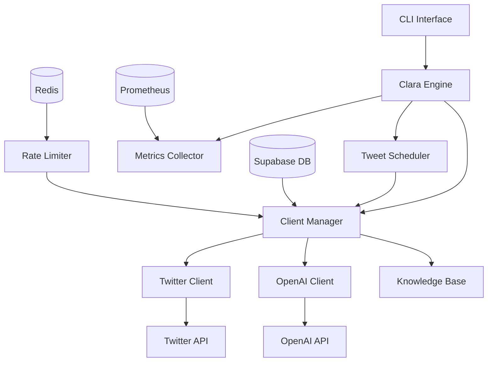
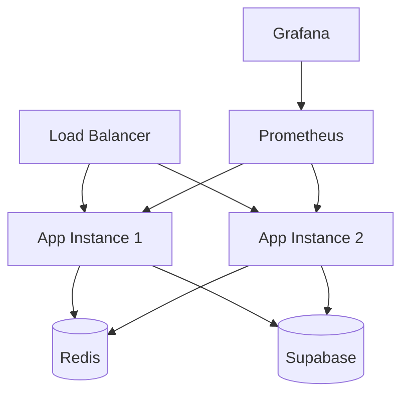

# Architecture Overview

Clara Engine is designed as a scalable, multi-tenant system for managing AI-powered Twitter bots. This document outlines the core architecture and how different components interact.

## System Architecture



## Core Components

### 1. Clara Engine
- Central orchestrator for all components
- Manages system lifecycle
- Handles graceful shutdown
- Coordinates health checks

### 2. Client Manager
- Manages multi-tenant client contexts
- Handles client initialization and cleanup
- Maintains client state and configuration
- Coordinates between components for each client

### 3. Tweet Scheduler
- Manages tweet generation and posting schedule
- Handles timezone-aware scheduling
- Implements rate limiting and backoff strategies
- Coordinates with Client Manager for execution

### 4. Rate Limiter
- Redis-based token bucket implementation
- Enforces per-client and global rate limits
- Handles concurrent request management
- Provides backpressure mechanism

### 5. Knowledge Base
- Vector-based semantic search
- Manages context for tweet generation
- Handles metadata filtering
- Provides relevance scoring

## Integration Points

### Twitter Integration
- Implements Twitter API v2
- Handles authentication and rate limits
- Manages media uploads
- Provides error handling and retries

### OpenAI Integration
- Manages API interactions
- Implements prompt management
- Handles response validation
- Includes caching layer

### Database Layer
- Supabase integration
- Handles client configuration
- Stores tweet history
- Manages system state

## Data Flow

1. **Tweet Generation Flow**
   ```mermaid
   sequenceDiagram
       Scheduler->>ClientManager: Request tweet generation
       ClientManager->>RateLimiter: Check limits
       RateLimiter-->>ClientManager: Approved
       ClientManager->>KnowledgeBase: Get context
       ClientManager->>OpenAIClient: Generate tweet
       OpenAIClient-->>ClientManager: Tweet content
       ClientManager->>TwitterClient: Post tweet
       TwitterClient-->>ClientManager: Tweet ID
       ClientManager->>Database: Update status
   ```

2. **Client Management Flow**
   ```mermaid
   sequenceDiagram
       CLI->>Engine: Add client
       Engine->>Database: Store configuration
       Engine->>ClientManager: Initialize client
       ClientManager->>TwitterClient: Validate credentials
       ClientManager->>OpenAIClient: Initialize client
       ClientManager->>KnowledgeBase: Setup context
       ClientManager-->>Engine: Client ready
   ```

## Security Model

### Authentication
- API key based authentication for external services
- Role-based access control for client operations
- Secure credential storage in environment variables

### Data Isolation
- Per-client data segregation
- Isolated rate limiting
- Separate knowledge base contexts

### Monitoring
- Prometheus metrics collection
- Per-client usage tracking
- System health monitoring
- Error rate tracking

## Configuration Management

### Environment Variables
- API credentials
- Service endpoints
- System configuration
- Rate limit settings

### Client Configuration
- Twitter API credentials
- Posting schedule
- Prompt configuration
- Rate limit settings

## Scalability Considerations

### Horizontal Scaling
- Stateless components
- Redis for distributed state
- Database connection pooling
- Load balancer ready

### Rate Limiting
- Per-client quotas
- Global rate limiting
- Distributed rate limiting with Redis
- Backpressure handling

### Resource Management
- Connection pooling
- Cache management
- Memory usage optimization
- Graceful degradation

## Error Handling

### Retry Mechanism
- Exponential backoff
- Per-service retry policies
- Circuit breaker pattern
- Error categorization

### Monitoring
- Error rate tracking
- Alert thresholds
- Error logging
- Performance metrics

## Development Guidelines

### Code Organization
- Modular design
- Clear separation of concerns
- Interface-based design
- Comprehensive testing

### Best Practices
- Type hints throughout
- Comprehensive logging
- Error handling
- Documentation

## Deployment Architecture

### Production Setup


### High Availability
- Multiple app instances
- Redis failover
- Database replication
- Load balancing

## Future Considerations

1. **Scalability Improvements**
   - Kafka integration for event streaming
   - Horizontal scaling of components
   - Enhanced caching strategies

2. **Feature Additions**
   - Advanced analytics
   - A/B testing framework
   - Enhanced monitoring
   - UI dashboard

3. **Performance Optimizations**
   - Query optimization
   - Caching improvements
   - Rate limit tuning
   - Resource utilization 